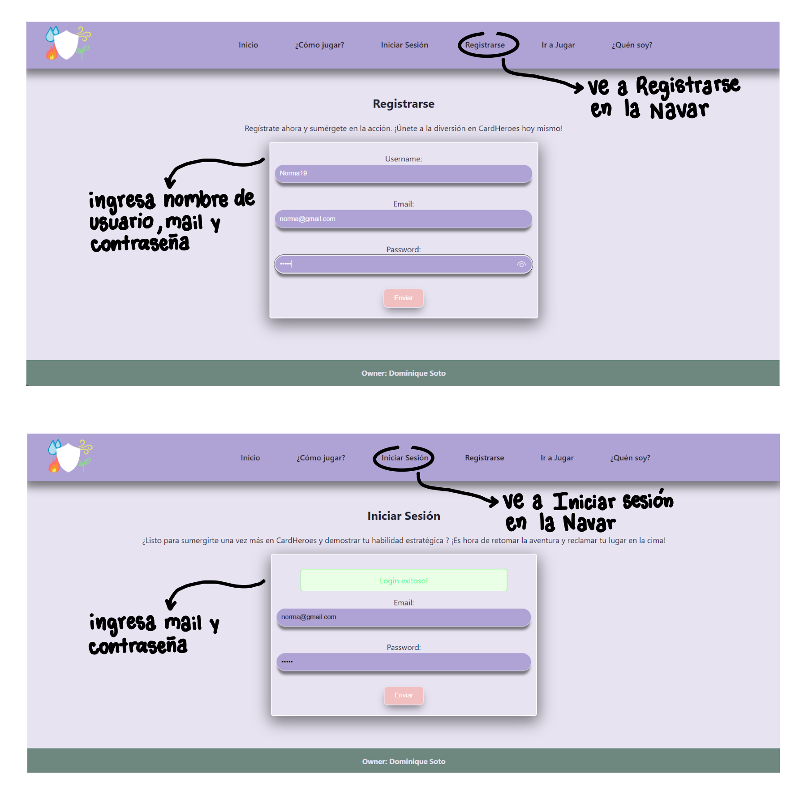
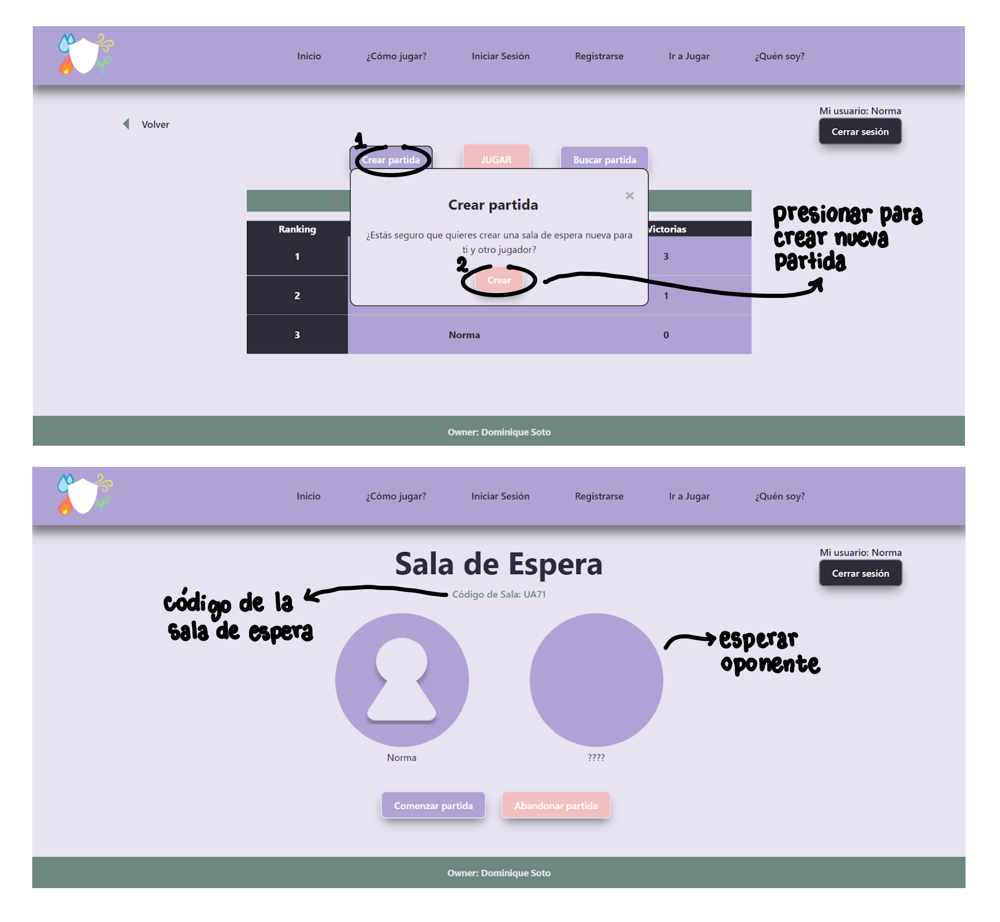
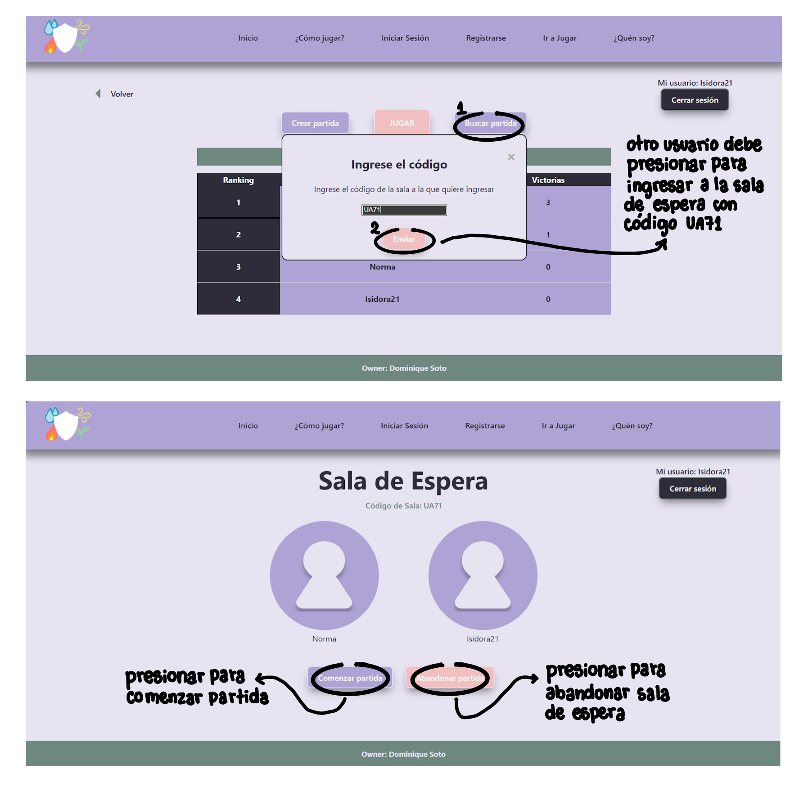
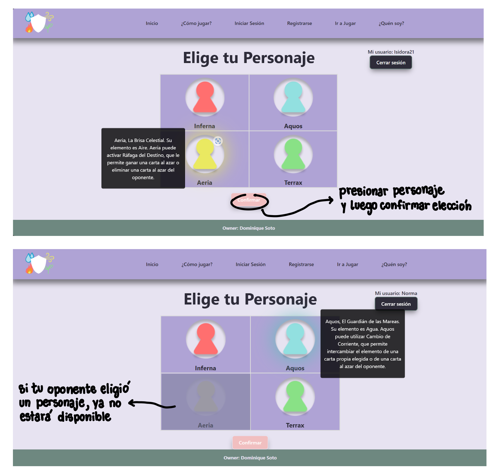
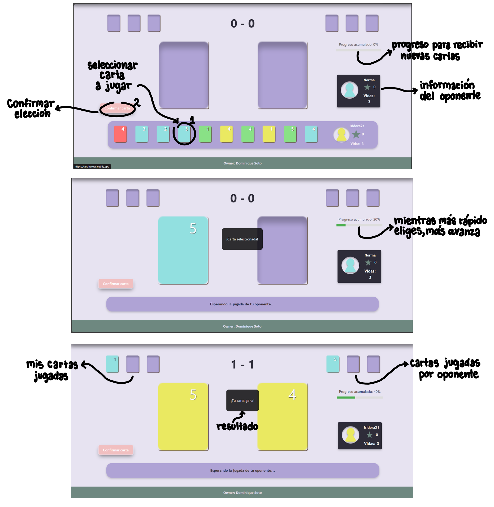
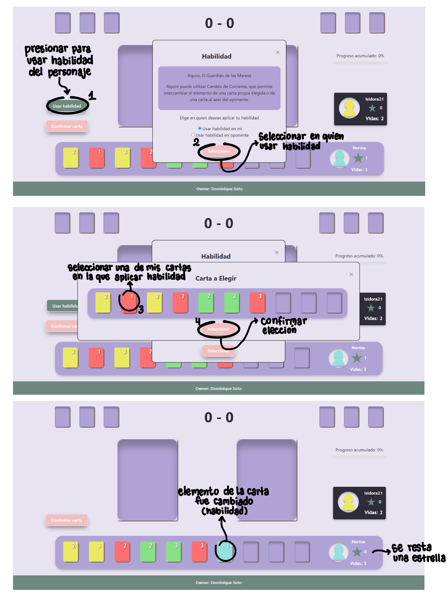
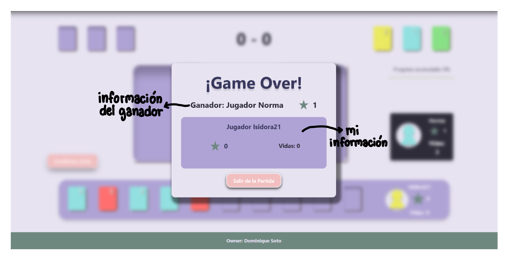

# CardHeroes :video_game: :black_joker: 

¡Bienvenido a **CardHeroes**, un juego de cartas 1 v/s 1 basado en elementos (fuego, agua, aire y tierra) diseñado para desafiar tu estrategia y habilidad! Enfréntate en intensas batallas y demuestra tu maestría elemental. 🌪️🔥💧🌍

🌐 [Juega ahora](https://cardheroes.netlify.app/)

---

## 🖥️ Frontend

El frontend de **CardHeroes** está desarrollado en **React**, una biblioteca de JavaScript enfocada en construir interfaces de usuario rápidas y dinámicas. Además, utiliza:

- **React Router**: para la gestión de rutas y navegación.
- **Axios**: para la comunicación eficiente con el backend.
- **Vite**: como herramienta de desarrollo y construcción rápida.

El diseño del frontend fue creado en **Figma**. Puedes ver los mockups y el diseño completo en el siguiente enlace:  
[Diseño en Figma](https://www.figma.com/design/mhZBSidLsBYUH5goohwOgO/Mockups-Personal?node-id=0-1&t=Ccs2qu0dcE4q8zdS-1)

### 💻 Cómo ejecutar el frontend localmente:

1. Clona el repositorio.
2. Instala las dependencias ejecutando:  
   ```bash
   yarn install
3. Inicia el servidor de desarrollo con:  
   ```bash
   yarn dev

---

## 🛡️ Backend

Repositorio del backend: [**GitHub - CardHeroes Backend**](https://github.com/Dominique236/CardHeroes_backend.git)

El backend de **CardHeroes** está construido con **Node.js** y utiliza **Koa**, un framework ligero y moderno que permite la creación de APIs rápidas y flexibles. Algunas de las características principales del backend incluyen:

- **Koa Router**: Maneja las rutas de manera sencilla y modular.
- **Koa Body**: Procesa las solicitudes HTTP con facilidad.
- **JSON Web Tokens (JWT)**: Implementa autenticación segura basada en tokens.
- **Sequelize**: Un ORM que facilita la interacción con bases de datos PostgreSQL.
- **Bcrypt**: Para hashear las contraseñas de los usuarios.

### 💻 Cómo ejecutar el backend localmente:

1. Clona el repositorio del backend.  
2. Instala las dependencias con:  
   ```bash
   yarn install
3. Inicia el servidor de desarrollo con:  
   ```bash
   yarn dev

### 📊 Comandos útiles del backend:

- **Migraciones**: Ejecuta las migraciones para configurar la base de datos.  
   ```bash
   yarn sequelize-cli db:migrate
- **Datos iniciales (seeders)**: Inserta datos iniciales en la base de datos.  
   ```bash
   yarn sequelize-cli db:seed:all

---

## 🚀 Despliegue

El frontend de **CardHeroes** está desplegado en **Netlify** y está disponible en:  [https://cardheroes.netlify.app/](https://cardheroes.netlify.app/)

El backend de **CardHeroes** está desplegado en **Render** y está disponible en:  [https://cardheroes-api.onrender.com](https://cardheroes-api.onrender.com)

---

## 🕹️ Demostración y explicación de como jugar

### 1. Inicio de Sesión
El usuario se registra y luego ingresa sus credenciales para acceder al juego.
   

### 2. Comenzar partida:
Una vez logueado, el usuario puede iniciar una nueva partida. Mientras que otro usuario logueado podría ingresar a la misma sala de espera.
   
   

### 3. Elegir personaje:
Antes de jugar, cada jugador debe seleccionar su personaje favorito.
   

### 4. Jugar:
Aquí cada jugador va eligiendo la carta que desea jugar de forma estratégica.
   

### 5. Usar habilidad:
Durante el juego, si un jugador logro ganar una ronda, obtendrá una estrella. Esta estrella permite usar la habilidad especial del personaje elegido al comienzo.
   

### 6. Fin del juego:
Cuando termina la partida, es decir, un jugador se queda sin vidas, se muestra un resumen del resultado.
   
